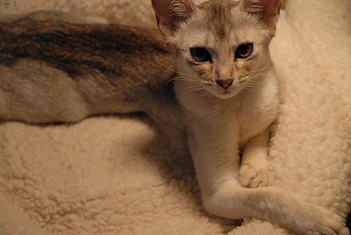
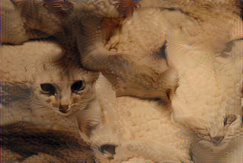
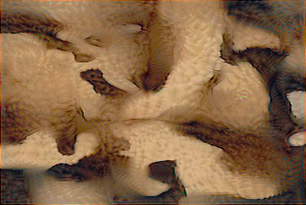

# Texture Synthesis Program for Top-K neuron visualization


## Texture synthesis with Top-K + non Top-K neurons

```
python3 synthesize.py -i ../few-shot-img-syn/data/cat -o output_cat_all --topk 1.
```

## Texture synthesis with non Top-K neurons only

```
python3 synthesize.py -i ../few-shot-img-syn/data/cat -o output_cat_non_topk --topk 0.05 --reverse_topk
```
We can see that in this context, where the texture of the cat and its surrounding is similar, top K still retains some structural information where as non-top retains negligible structural information.



<h4 align="left">Original Cat Image</h4>




<h4 align="left">TopK + Non TopK </h4>




<h4 align="left">  Non TopK </h4>

