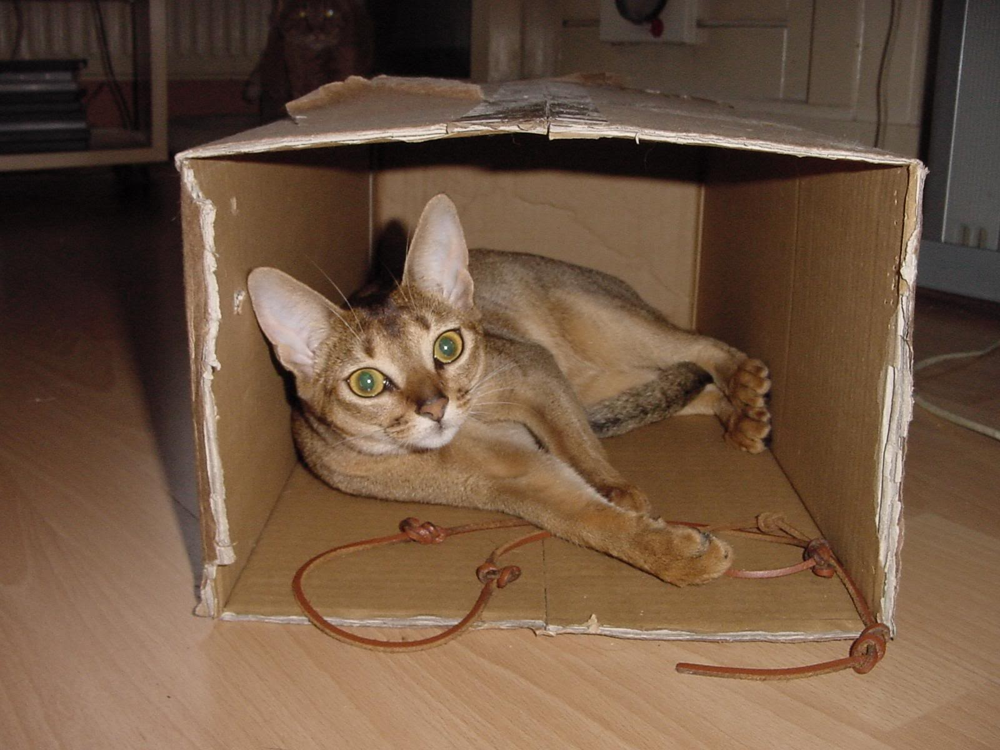

# Texture Synthesis Program for Top-K neuron visualization


## Texture synthesis with Top-K + non Top-K neurons

```
python3 synthesize.py -i ../few-shot-img-syn/data/cat -o output_cat_all --topk 1.
```

## Texture synthesis with non Top-K neurons only

```
python3 synthesize.py -i ../few-shot-img-syn/data/cat -o output_cat_non_topk --topk 0.05 --reverse_topk
```




<h4 align="center">The efficient frontier of the brute force approach including the 1/n portfolio, using the training data.</h4>
